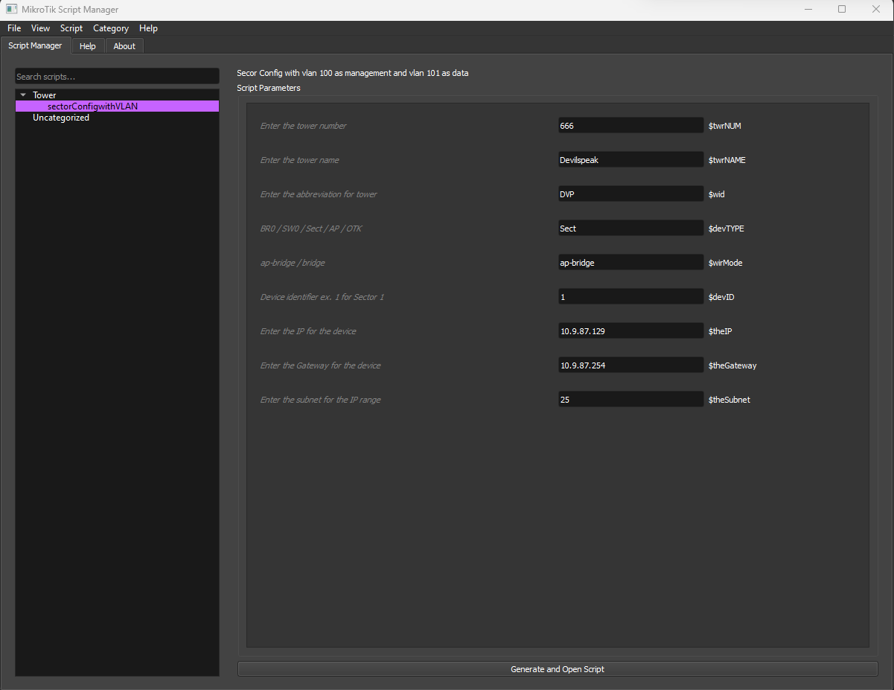
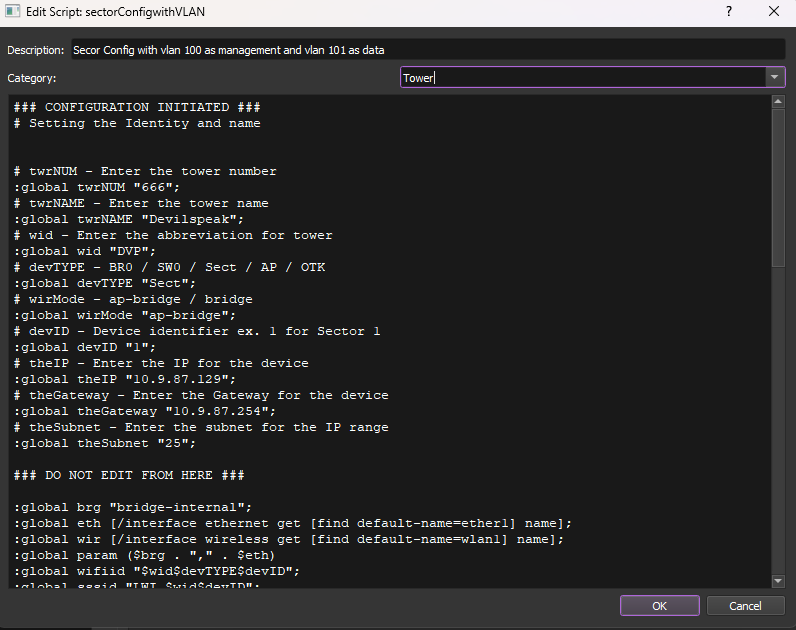
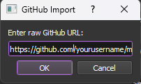

# 🚀 MikroTik Script Manager

<div align="center">


*A powerful, modern GUI application for managing, organizing, and parameterizing MikroTik RouterOS scripts*

[Features](#-features) • [Installation](#-installation) • [Usage](#-usage) • [Screenshots](#-screenshots) • [Contributing](#-contributing)

</div>

## ✨ Features

### 🎯 **Core Functionality**
- **Script Organization**: Organize your scripts into custom categories
- **Variable Parameterization**: Extract and customize script variables with ease
- **Syntax Highlighting**: Beautiful MikroTik script syntax highlighting
- **One-Click Generation**: Generate and open customized scripts instantly

### 🌐 **GitHub Integration**
- **Import from GitHub**: Direct import from GitHub raw URLs and Gists
- **Export to GitHub**: Share your scripts via GitHub Gists *(coming soon)*
- **Version Control**: Keep track of your script versions

### 🎨 **User Experience**
- **Dark/Light Theme**: Choose your preferred interface theme
- **Search & Filter**: Quickly find scripts with powerful search
- **Context Menus**: Right-click actions for efficient workflow
- **Drag & Drop**: Easy script management *(planned)*

### 🔧 **Advanced Features**
- **Script Editor**: Built-in editor with MikroTik syntax highlighting
- **Variable Extraction**: Automatically detect and extract script parameters
- **Description Support**: Add detailed descriptions to your scripts
- **Backup & Restore**: Automatic data backup and recovery

## 🏗️ Architecture

```
MikroTik Script Manager/
├── main.py                    # Application entry point
├── requirements.txt           # Python dependencies
├── core/
│   ├── github_importer.py    # GitHub integration
│   └── script_manager.py     # Core script management logic
└── ui/
    ├── highlighter.py        # Syntax highlighting
    ├── main_window.py        # Main GUI implementation
    └── styles.py             # Theme and styling
```

## 📦 Installation

### Prerequisites
- Python 3.7 or higher
- pip package manager

### Quick Install

```bash
# Clone the repository
git clone https://github.com/yourusername/mikrotik-script-manager-v2-py.git
cd mikrotik-script-manager-v2-py

# Install dependencies
pip install -r requirements.txt

# Run the application
python main.py
```

### Alternative Installation Methods

<details>
<summary>🐳 Docker Installation</summary>

```bash
# Build the Docker image
docker build -t mikrotik-script-manager-v2-py .

# Run the container
docker run -it --rm -e DISPLAY=$DISPLAY -v /tmp/.X11-unix:/tmp/.X11-unix mikrotik-script-manager-v2-py
```
</details>

<details>
<summary>📦 Executable Build</summary>

```bash
# Install PyInstaller
pip install PyInstaller

# Build executable
pyinstaller --onefile --windowed main.py

# Find executable in dist/ folder
```
</details>

## 🚀 Usage

### Getting Started

1. **Launch the Application**
   ```bash
   python main.py
   ```

2. **Import Your First Script**
   - Use `File → Import Script` for local files
   - Use `File → Import from GitHub` for remote scripts

3. **Organize Scripts**
   - Create categories with `Category → New Category`
   - Drag scripts between categories

4. **Parameterize Scripts**
   - Select a script to view its parameters
   - Modify values in the parameters panel
   - Click "Generate and Open Script"

### Script Format

For optimal compatibility, format your MikroTik scripts like this:

```routeros
# serverip - Server IP Address
:global serverip "192.168.1.1"

# username - Login Username  
:global username "admin"

# timeout - Connection timeout in seconds
:global timeout "30"

### DO NOT EDIT FROM HERE ###

/system identity
set name="Router-$username"

/ip firewall filter
add chain=forward src-address=$serverip action=accept
```

### Variable Types Supported

- **Global Variables**: `:global varname "value"`
- **Set Variables**: `:set $varname "value"`
- **Inline Variables**: `$varname` replacements
- **Comments**: `# varname - Description` format

## 📸 Screenshots

<details>
<summary>🖼️ View Screenshots</summary>

### Main Interface


### Script Editor


### GitHub Import


</details>

## 🛠️ Development

### Setting Up Development Environment

```bash
# Clone and setup
git clone https://github.com/yourusername/mikrotik-script-manager-v2-py.git
cd mikrotik-script-manager-v2-py

# Create virtual environment
python -m venv venv
source venv/bin/activate  # On Windows: venv\Scripts\activate

# Install development dependencies
pip install -r requirements.txt
pip install black flake8 autopep8

# Run tests
python -m pytest tests/
```

### Code Style

We use `black` for code formatting and `flake8` for linting:

```bash
# Format code
black .

# Check code style
flake8 .

# Auto-fix common issues
autopep8 --in-place --recursive .
```

## 🤝 Contributing

We welcome contributions! Here's how you can help:

### 🐛 Bug Reports
- Use the [issue tracker](https://github.com/NorthFi/mikrotik-script-manager-v2-py/issues)
- Include steps to reproduce
- Provide system information

### 💡 Feature Requests
- Check existing [feature requests](https://github.com/NorthFi/mikrotik-script-manager-v2-py/labels/enhancement)
- Describe the use case
- Explain the expected behavior

### 🔧 Pull Requests
1. Fork the repository
2. Create a feature branch (`git checkout -b feature/amazing-feature`)
3. Commit your changes (`git commit -m 'Add amazing feature'`)
4. Push to the branch (`git push origin feature/amazing-feature`)
5. Open a Pull Request

## 📋 Roadmap

### 🎯 Version 2.4 (Next Release)
- [ ] Drag & drop script organization
- [ ] Script templates system
- [ ] Export to GitHub Gists
- [ ] Script validation and testing

### 🚀 Version 3.0 (Future)
- [ ] Plugin system
- [ ] Script scheduling integration
- [ ] Remote RouterOS deployment
- [ ] Collaborative script sharing

## 🐛 Known Issues

- GitHub export functionality temporarily disabled
- Large scripts may cause UI lag during syntax highlighting
- Windows executable may trigger antivirus warnings

## 📄 License

This project is licensed under the MIT License - see the [LICENSE](LICENSE) file for details.

## 🙏 Acknowledgments

- **MikroTik** for creating RouterOS and inspiring this tool
- **Qt/PyQt5** for the excellent GUI framework
- **GitHub** for hosting and API services
- **Contributors** who help make this project better

## 📞 Support

- **Issues**: [GitHub Issues](https://github.com/NorthFi/mikrotik-script-manager-v2-py/issues)
- **Email**: support@northfi.co.za

---

<div align="center">

**Made with ❤️ for the MikroTik community**

[⭐ Star this repo](https://github.com/NorthFi/mikrotik-script-manager-v2-py) • [🐛 Report Bug](https://github.com/NorthFi/mikrotik-script-manager-v2-py/issues) • [💡 Request Feature](https://github.com/NorthFi/mikrotik-script-manager-v2-py/issues)

</div>
